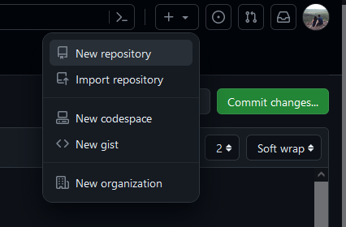
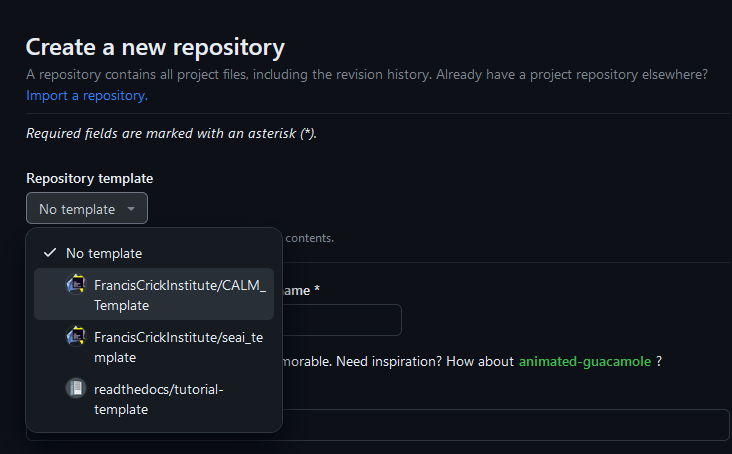

# CALM Template Repository

[](https://mybinder.org/v2/gh/FrancisCrickInstitute/CALM_Template/HEAD?labpath=blob%2Fmain%2Fsegment_image.ipynb)
[](https://www.python.org/downloads/release/python-3115/)


## Overview

The CALM Template is designed to provide a starting point for researchers to publish and share their image analysis code effectively. This might include, but is not limited to...
* ImageJ/FIJI Macros
* CellProfiler pipelines
* ilastik projects
* Jupyter notebooks
* Python scripts
* MATLAB scripts

### Why?

* It is often the case that publishing code is left until the last minute when a paper is being submitted, which results in published code that is in no way reusable.
* If the code is not reusable and cannot be run by anyone other than you, then nobody is going to be able to reproduce your published results!
* So, put as much time and effort into publishing your code as you do into writing the methods section of your paper.

### What Should You Include?

When publishing image analysis protocols, we recommend following the guidance in the following article:

> Schmied, C., Nelson, M.S., Avilov, S. et al. Community-developed checklists for publishing images and image analyses. _Nat Methods_ (2023). https://doi.org/10.1038/s41592-023-01987-9

But at the absolute minimum, your repository should include the following:
* All required code
  * Ideally, this should be structured in a logical fashion using directories and sub-directories as necessary.
* Instructions on how to run your code
  * This is crucial - do not assume that anyone will be able to figure out what your code does! Provide basic, step-by-step instructions on how to run your code, including any prerequisites that need to be installed.
* Test Data
  * Your repository should contain some test data that anyone can run your code on to verify that it is performing as it should be. You should also provide the corresponding output data to validate the code.

## Getting Started

### Requirements

In order to create your own repository from this template, you will need:
* A GitHub account.
* Basic knowledge of git operations.
* Membership of the [Francis Crick Insitute organisation on Github](https://github.com/FrancisCrickInstitute).

### How to Make Use of this Template

Once all of the above requirements are met, you can create your own repository using this repo as a template. To do so...

1. Click on `+` dropdown menu on the top-right of this screen and select `New repository`:



2. Then, select `FrancisCrickInstitute/CALM_Template` from the list of options that should appear when you click on the `Repository template` dropdown:



3. Complete the rest of the details and you should end up with a new repository that looks just like this one, which you can edit according to your needs.

## How To Run the Code in This Repo

* This repository is intended only as a demo and to provide rough guidelines on how you should publish your own code.
* The main functional element here is a single, relatively sumple Jupyter Notebook - if you are publishing a FIJI macro or a MATLAB script, then your repository will look a little different, but the basic principles outlined above remain the same.

A step-by-step guide is presented below. **You only need to perform steps 1 and 2 once.** Every subsequent time you want to run the code, skip straight to step 3.

### Step 1
#### Install a Python Distribution

We recommend using conda as it's relatively straightforward and makes the management of different Python environments simple. You can install conda from [here](https://conda.io/projects/conda/en/latest/user-guide/install/index.html#regular-installation) (miniconda will suffice).

### Step 2
#### Set Up Environment

Once conda is installed, open a terminal (Mac) or command line (Windows) and run the following series of commands:

```
conda create --name calm_template pip
conda activate calm_template
python -m pip install -r <path to this repo>/requirements.txt
```
where you need to replace `<path to this repo>` with the location on your file system where you downloaded this repo. You will be presented with a list of packages to be downloaded and installed. The following prompt will appear:
```
Proceed ([y]/n)?
```
Hit Enter and all necessary packages will be downloaded and installed - this may take some time. When complete, you can deactivate the environment you have created with the following command.

```
conda deactivate
```
You have successfully set up an environment!

### Step 3
#### Open the notebook

The following commands will launch a Jupyter notebook:
```
conda activate calm_template
jupyter notebook <path to this repo>/zebrafish_age_estimator.ipynb
```

The Jupyter Notebook should open in your browser - follow the step-by-step instructions in the notebook to run the code. If you are not familiar with Jupyter Notebooks, you can find a detailed introduction [here](https://jupyter-notebook.readthedocs.io/en/latest/notebook.html#introduction).

### (Optional) Step 4
#### Set up your repo to run on Binder

[Binder](https://mybinder.org/) is a really nice way to allow people to run your Jupyter notebooks directly from GitHub - just [follow this handy guide from the Turing Institute](https://the-turing-way.netlify.app/communication/binder/zero-to-binder.html) to get your repo set up. To run the code in this template repo on Binder, click [here](https://mybinder.org/v2/gh/FrancisCrickInstitute/CALM_Template/HEAD?labpath=blob%2Fmain%2Fsegment_image.ipynb).
